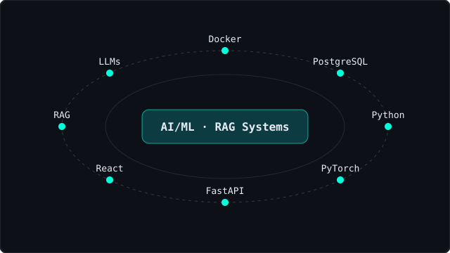

<h3><code>varun@github ~ $ ./contributions.sh</code></h3>

  

<h3><code>varun@github ~ $ whoami</code></h3>
<table>
  <tr>
    <td valign="top"></td>
    <td valign="top"></td>
  </tr>
</table>

---

### `~/about.md`

AI/ML Engineer specializing in production-grade, full-stack AI systems — Machine Learning model training and evaluation in PyTorch, Agentic RAG pipelines, LLM applications. Final-year B.E. AI & Data Science, VTU (CGPA 7.9/10). Bias toward systems that are secure, well-tested, and run in production, not just a notebook.

### `~/stack --icons`

`RAG · LLMs · LangChain · LangGraph · MCP · Hugging Face · FAISS · XGBoost · SHAP · JWT · Redis · Qdrant · CI/CD · FHIR R4 · OMOP CDM`

### `~/stack-orbit/`

### `~/projects/`

| Project | What | Links |
|---|---|---|
| ⭐ **Aurelia AI** — Multi-Tenant AI Customer Support Platform (2026) | Qdrant-backed knowledge bases, SSE streaming chat, RAG over docs + websites, LLM routing across OpenAI/Anthropic/Google/DeepSeek | [Demo](https://aurelia-ai-topaz.vercel.app) · [Code](https://github.com/Varunbp06/aurelia-ai) |
| **NexaMind AI** — Enterprise Agentic RAG Workspace (2025) | Document chat, streaming AI conversations, multi-step agent workflows, MCP tool calling, Chroma/Milvus | [Demo](https://nexamindai.vercel.app/) · [Code](https://github.com/Varunbp06/nexamind-ai) |
| **Aurevia Health AI** — Clinical Intelligence Platform (2025) | LangGraph multi-agent RAG, CatBoost/XGBoost/TabICLv2 + SHAP, FHIR R4 / OMOP CDM, RBAC + PII redaction | [Demo](https://aurevia-health-ai.vercel.app/) · [Code](https://github.com/Varunbp06/aurevia-health-ai) |

### `~/education/`

| School | Detail | Years |
|---|---|---|
| Visvesvaraya Technological University (VTU) | B.E. Artificial Intelligence & Data Science · CGPA 7.9/10 | 2022 – 2026 |
| Hoysala PU College | Pre-University, Science (PCM) · 78% | 2020 – 2022 |
| SBS School | SSLC · 90.56% | 2019 |

### `~/certs/`

- Hugging Face — LLM Course · Agents Course · Context Engineering · MCP Course (certificates in hand)
- Microsoft Applied Skills — Develop an agent with integrated tools
- DeepLearning.AI & OpenAI — ChatGPT Prompt Engineering for Developers
- Databricks — Generative AI Fundamentals Accreditation
- IBM SkillsBuild — AI Fundamentals · Microsoft Learn — Explore Generative AI

### `~/languages/`

English (Full Professional) · Hindi (Professional) · Kannada (Native) · Telugu (Professional)

### `~/snake/`

<picture>
  <source media="(prefers-color-scheme: dark)" srcset="https://raw.githubusercontent.com/Varunbp06/Varunbp06/output/github-snake-dark.svg" />
  <source media="(prefers-color-scheme: light)" srcset="https://raw.githubusercontent.com/Varunbp06/Varunbp06/output/github-snake.svg" />
  
</picture>

<code>auto-generated daily via Actions · appears after first run</code>

### `~/3d-graph/`

<code>auto-generated daily via Actions · appears after first run</code>

### `~/contact/`

- Portfolio: https://varunbp-portfolio.vercel.app/
- Mail: varunbpvarunbp@gmail.com
- LinkedIn: https://linkedin.com/in/varunbp09
- Location: Nelamangala, Karnataka, India

